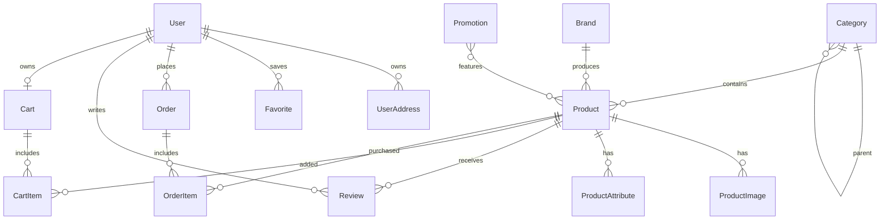

# Подробный разбор проекта для сдачи

Файл предназначен для подготовки к защите проекта. Основной упор сделан на backend, Django и Django REST Framework: архитектура, модели данных, API, бизнес-логика, авторизация, настройки, запуск, тесты и типовые вопросы преподавателя.

Проект находится в каталоге:

```text
/Users/pc/Downloads/пракимка
```

## 1. Краткое описание проекта

Это монорепозиторий интернет-магазина мебели. В нем есть backend на Django/DRF и frontend на React/Vite.

Основная идея проекта: реализовать ecommerce-платформу с каталогом мебели, категориями, брендами, карточками товаров, корзиной, оформлением заказа, избранным, отзывами, профилем пользователя и административной частью.

Ключевые возможности:

- регистрация и авторизация пользователей через JWT;
- каталог товаров с фильтрацией, поиском, сортировкой и пагинацией;
- категории и бренды;
- детальная страница товара;
- корзина для гостя и авторизованного пользователя;
- оформление заказа из корзины;
- история заказов;
- избранное;
- отзывы с пересчетом рейтинга товара;
- роли пользователей: покупатель, менеджер, администратор;
- Django Admin;
- API-документация через Swagger/OpenAPI;
- импорт каталога из CSV;
- генерация демо-каталога management-командой.

## 2. Технологический стек

Backend:

- Python;
- Django 5.1.4;
- Django REST Framework 3.15.2;
- SimpleJWT для JWT-аутентификации;
- django-filter для фильтрации;
- drf-spectacular для OpenAPI/Swagger;
- SQLite для локального запуска;
- PostgreSQL в Docker Compose;
- Redis cache в Docker Compose;
- django-storages + boto3 для S3/MinIO media в production-сценарии;
- Gunicorn для production-запуска backend-контейнера.

Frontend:

- React 19;
- Vite;
- TypeScript;
- TailwindCSS;
- TanStack Query;
- Axios;
- Zustand;
- React Router;
- lucide-react.

Инфраструктура:

- Docker Compose;
- PostgreSQL;
- Redis;
- MinIO;
- Nginx reverse proxy.

## 3. Главная архитектурная идея

Проект разделен на несколько Django apps по предметным областям:

```text
backend/apps/
  common/    общие базовые модели и permissions
  users/     пользователь, адреса, избранное, профиль, регистрация
  catalog/   категории, бренды, товары, изображения, атрибуты, акции
  cart/      корзина и позиции корзины
  orders/    заказы, позиции заказов, адреса, уведомления
  reviews/   отзывы и пересчет рейтинга товара
```

Такое деление удобно объяснять на защите:

- каждая app отвечает за отдельную бизнес-область;
- модели и API не смешаны в одном большом модуле;
- зависимости между apps отражают реальные связи интернет-магазина;
- `common` содержит переиспользуемые элементы.

Главный Django-проект:

```text
backend/config/
  settings.py  настройки проекта
  urls.py      маршрутизация API, admin и docs
  wsgi.py      WSGI entrypoint
  asgi.py      ASGI entrypoint
```

## 4. Структура проекта

Упрощенная карта:

```text
.
  README.md
  docker-compose.yml
  .env.example
  sample-catalog.csv

  backend/
    Dockerfile
    manage.py
    requirements.txt
    db.sqlite3
    config/
      settings.py
      urls.py
      wsgi.py
      asgi.py
    apps/
      common/
      users/
      catalog/
      cart/
      orders/
      reviews/

  frontend/
    package.json
    vite.config.ts
    src/
      app/
      pages/
      widgets/
      features/
      entities/
      shared/

  infra/
    nginx/
      default.conf
```

На защите можно сказать:

> Проект построен как fullstack-приложение. Backend предоставляет REST API, frontend обращается к нему через Axios. Django отвечает за бизнес-логику, модели, авторизацию и админку. React отвечает за пользовательский интерфейс.

## 5. Backend: основные точки входа

Главные файлы backend:

- `backend/manage.py` - стандартная точка запуска Django-команд;
- `backend/config/settings.py` - настройки Django;
- `backend/config/urls.py` - маршруты проекта;
- `backend/apps/*/models.py` - модели базы данных;
- `backend/apps/*/serializers.py` - преобразование моделей в JSON и валидация входных данных;
- `backend/apps/*/views.py` - API endpoints;
- `backend/apps/*/admin.py` - настройки Django Admin;
- `backend/apps/*/tests.py` - тесты.

## 6. Настройки Django: `config/settings.py`

Файл `backend/config/settings.py` отвечает за конфигурацию проекта.

### 6.1 BASE_DIR

```python
BASE_DIR = Path(__file__).resolve().parent.parent
```

`BASE_DIR` указывает на директорию `backend/`. От нее строятся пути к SQLite базе, static/media и другим локальным файлам.

### 6.2 env_bool

```python
def env_bool(name: str, default: bool = False) -> bool:
    return os.getenv(name, str(default)).lower() in {"1", "true", "yes", "on"}
```

Эта функция читает boolean-переменные окружения. Например:

- `DEBUG=True`;
- `USE_SQLITE=True`.

Она нужна, потому что переменные окружения всегда приходят строками.

### 6.3 SECRET_KEY, DEBUG, ALLOWED_HOSTS

```python
SECRET_KEY = os.getenv("SECRET_KEY", "dev-secret-key")
DEBUG = env_bool("DEBUG", True)
ALLOWED_HOSTS = [host.strip() for host in os.getenv("ALLOWED_HOSTS", "localhost,127.0.0.1").split(",")]
```

В dev-режиме есть значения по умолчанию. Для production в README отдельно указано, что нужно заменить `SECRET_KEY`, отключить `DEBUG` и задать реальные hosts.

На защите важно сказать:

> В проекте используется env-based configuration: параметры берутся из переменных окружения. Это позволяет запускать один и тот же код локально, в Docker и в production.

### 6.4 INSTALLED_APPS

В `INSTALLED_APPS` подключены:

- стандартные Django apps: admin, auth, sessions, staticfiles;
- сторонние библиотеки: `corsheaders`, `django_filters`, `rest_framework`, `drf_spectacular`, `storages`;
- локальные apps: `apps.common`, `apps.users`, `apps.catalog`, `apps.cart`, `apps.orders`, `apps.reviews`.

Важный момент:

```python
AUTH_USER_MODEL = "users.User"
```

Проект использует кастомную модель пользователя. Это правильно задавать в начале проекта, потому что потом менять `AUTH_USER_MODEL` сложно из-за миграций и связей.

### 6.5 Middleware

```python
MIDDLEWARE = [
    "corsheaders.middleware.CorsMiddleware",
    "django.middleware.security.SecurityMiddleware",
    ...
]
```

`CorsMiddleware` стоит вверху, чтобы frontend на другом порту мог обращаться к backend API.

Локально:

- frontend: `http://127.0.0.1:5173`;
- backend: `http://127.0.0.1:8001` или `8000`, если свободен.

### 6.6 База данных

Проект умеет работать с SQLite и PostgreSQL.

Если включен `USE_SQLITE=True`, используется SQLite:

```python
DATABASES = {
    "default": {
        "ENGINE": "django.db.backends.sqlite3",
        "NAME": BASE_DIR / "db.sqlite3",
    }
}
```

Иначе используется PostgreSQL:

```python
DATABASES = {
    "default": {
        "ENGINE": "django.db.backends.postgresql",
        "NAME": os.getenv("POSTGRES_DB", "nonton_clone"),
        ...
    }
}
```

Это удобно:

- SQLite - простой локальный запуск без Docker;
- PostgreSQL - реалистичная база для Docker/production.

### 6.7 Django REST Framework

```python
REST_FRAMEWORK = {
    "DEFAULT_AUTHENTICATION_CLASSES": ("rest_framework_simplejwt.authentication.JWTAuthentication",),
    "DEFAULT_PERMISSION_CLASSES": ("rest_framework.permissions.AllowAny",),
    "DEFAULT_SCHEMA_CLASS": "drf_spectacular.openapi.AutoSchema",
    "DEFAULT_PAGINATION_CLASS": "rest_framework.pagination.PageNumberPagination",
    "PAGE_SIZE": 24,
    "DEFAULT_FILTER_BACKENDS": (
        "django_filters.rest_framework.DjangoFilterBackend",
        "rest_framework.filters.SearchFilter",
        "rest_framework.filters.OrderingFilter",
    ),
    ...
}
```

Что это значит:

- аутентификация по умолчанию через JWT;
- по умолчанию API разрешает доступ всем, но конкретные viewsets переопределяют permissions;
- схема API генерируется через drf-spectacular;
- все списки по умолчанию пагинируются по 24 элемента;
- подключены фильтрация, поиск и сортировка.

### 6.8 JWT

```python
SIMPLE_JWT = {
    "ACCESS_TOKEN_LIFETIME": timedelta(minutes=int(os.getenv("JWT_ACCESS_MINUTES", "30"))),
    "REFRESH_TOKEN_LIFETIME": timedelta(days=int(os.getenv("JWT_REFRESH_DAYS", "14"))),
}
```

Пользователь получает:

- access token - короткоживущий токен для запросов;
- refresh token - токен для обновления access token.

API endpoints:

- `POST /api/auth/token/`;
- `POST /api/auth/token/refresh/`.

### 6.9 Swagger/OpenAPI

```python
SPECTACULAR_SETTINGS = {
    "TITLE": "Furniture Commerce API",
    "DESCRIPTION": "...",
    "VERSION": "1.0.0",
    "SERVE_INCLUDE_SCHEMA": False,
}
```

Документация доступна по:

```text
/api/docs/
```

Схема доступна по:

```text
/api/schema/
```

### 6.10 CORS

```python
CORS_ALLOWED_ORIGINS = [...]
CORS_ALLOW_CREDENTIALS = True
CSRF_TRUSTED_ORIGINS = CORS_ALLOWED_ORIGINS
```

CORS нужен, потому что frontend и backend работают на разных портах.

### 6.11 Cache

При SQLite используется local memory cache:

```python
"BACKEND": "django.core.cache.backends.locmem.LocMemCache"
```

При PostgreSQL/Docker используется Redis:

```python
"BACKEND": "django_redis.cache.RedisCache"
```

Кэш реально используется в `CategoryViewSet.list`: список категорий кэшируется на 10 минут.

### 6.12 Static и Media

```python
STATIC_URL = "static/"
STATIC_ROOT = BASE_DIR / "staticfiles"
MEDIA_URL = "media/"
MEDIA_ROOT = BASE_DIR / "media"
```

Локально media-файлы хранятся в `backend/media`.

Для production предусмотрено S3-хранилище:

```python
if AWS_STORAGE_BUCKET_NAME and not DEBUG:
    DEFAULT_FILE_STORAGE = "storages.backends.s3boto3.S3Boto3Storage"
```

## 7. URL routing: `config/urls.py`

Файл `backend/config/urls.py` собирает все API endpoints.

Используется `DefaultRouter` из DRF:

```python
router = DefaultRouter()
router.register("categories", CategoryViewSet, basename="categories")
router.register("brands", BrandViewSet, basename="brands")
router.register("products", ProductViewSet, basename="products")
router.register("promotions", PromotionViewSet, basename="promotions")
router.register("cart", CartViewSet, basename="cart")
router.register("orders", OrderViewSet, basename="orders")
router.register("addresses", AddressViewSet, basename="addresses")
router.register("reviews", ReviewViewSet, basename="reviews")
router.register("favorites", FavoriteViewSet, basename="favorites")
router.register("admin-users", AdminUserViewSet, basename="admin-users")
```

DRF router автоматически создает REST-маршруты:

- list;
- retrieve;
- create;
- update;
- partial_update;
- destroy;
- custom actions.

Основные URL:

```text
/admin/
/api/schema/
/api/docs/
/api/auth/register/
/api/auth/profile/
/api/auth/token/
/api/auth/token/refresh/
/api/storefront/
/api/categories/
/api/brands/
/api/products/
/api/promotions/
/api/cart/
/api/orders/
/api/addresses/
/api/reviews/
/api/favorites/
/api/admin-users/
```

## 8. Общий модуль `common`

### 8.1 TimeStampedModel

Файл: `backend/apps/common/models.py`

```python
class TimeStampedModel(models.Model):
    created_at = models.DateTimeField(auto_now_add=True)
    updated_at = models.DateTimeField(auto_now=True)

    class Meta:
        abstract = True
```

Это абстрактная модель. Она не создает отдельную таблицу, но добавляет поля `created_at` и `updated_at` дочерним моделям.

Преимущество:

- не нужно повторять поля времени в каждой модели;
- все сущности имеют одинаковую структуру аудита;
- можно сортировать, фильтровать и отображать даты создания/обновления.

Используется в:

- `Category`;
- `Brand`;
- `Product`;
- `ProductImage`;
- `ProductAttribute`;
- `Promotion`;
- `Cart`;
- `CartItem`;
- `Order`;
- `Review`;
- `UserAddress`;
- `Favorite`.

### 8.2 IsManagerOrAdminForWrite

Файл: `backend/apps/common/permissions.py`

```python
class IsManagerOrAdminForWrite(permissions.BasePermission):
    def has_permission(self, request, view):
        if request.method in permissions.SAFE_METHODS:
            return True
        user = request.user
        return bool(user and user.is_authenticated and (user.is_staff or getattr(user, "role", "") in {"manager", "admin"}))
```

Логика permission:

- безопасные методы `GET`, `HEAD`, `OPTIONS` доступны всем;
- запись доступна только авторизованному staff/manager/admin.

Это используется для каталога:

- категории;
- бренды;
- товары.

На защите:

> Для публичной витрины чтение открыто всем пользователям, но изменение каталога доступно только персоналу магазина.

## 9. Модуль пользователей `users`

Файлы:

```text
backend/apps/users/models.py
backend/apps/users/serializers.py
backend/apps/users/views.py
backend/apps/users/admin.py
backend/apps/users/tests.py
```

### 9.1 Модель User

```python
class User(AbstractUser):
    class Role(models.TextChoices):
        CUSTOMER = "customer", "Покупатель"
        MANAGER = "manager", "Менеджер"
        ADMIN = "admin", "Администратор"

    email = models.EmailField(unique=True)
    phone = models.CharField(max_length=32, blank=True)
    role = models.CharField(max_length=20, choices=Role.choices, default=Role.CUSTOMER)

    REQUIRED_FIELDS = ["email"]
```

Модель наследуется от `AbstractUser`, поэтому сохраняет стандартные поля Django:

- username;
- password;
- first_name;
- last_name;
- is_staff;
- is_superuser;
- is_active;
- date_joined;
- last_login.

Добавлены:

- уникальный email;
- телефон;
- роль пользователя.

Роли:

- `customer` - обычный покупатель;
- `manager` - менеджер, может управлять каталогом;
- `admin` - администратор на уровне бизнес-роли.

Важно различать:

- `role="admin"` - бизнес-роль в проекте;
- `is_superuser=True` - системный Django-суперпользователь.

### 9.2 UserAddress

```python
class UserAddress(TimeStampedModel):
    user = models.ForeignKey(User, on_delete=models.CASCADE, related_name="addresses")
    title = models.CharField(max_length=80, default="Дом")
    city = models.CharField(max_length=120)
    street = models.CharField(max_length=255)
    apartment = models.CharField(max_length=40, blank=True)
    entrance = models.CharField(max_length=40, blank=True)
    floor = models.CharField(max_length=40, blank=True)
    is_default = models.BooleanField(default=False)
```

Один пользователь может иметь много адресов.

Связь:

```text
User 1 -> many UserAddress
```

`on_delete=models.CASCADE` означает: если пользователь удален, его адреса тоже удаляются.

### 9.3 Favorite

```python
class Favorite(TimeStampedModel):
    user = models.ForeignKey(User, on_delete=models.CASCADE, related_name="favorites")
    product = models.ForeignKey("catalog.Product", on_delete=models.CASCADE, related_name="favorited_by")

    class Meta:
        unique_together = ("user", "product")
```

Избранное связывает пользователя и товар.

`unique_together = ("user", "product")` запрещает добавить один и тот же товар в избранное два раза одним пользователем.

Связь:

```text
User many -> many Product через Favorite
```

### 9.4 RegisterSerializer

Файл: `backend/apps/users/serializers.py`

```python
class RegisterSerializer(serializers.ModelSerializer):
    password = serializers.CharField(write_only=True, min_length=8)
```

Особенности:

- пароль только на запись (`write_only=True`);
- минимальная длина 8 символов;
- пароль не сохраняется напрямую, а хэшируется:

```python
user.set_password(password)
```

Это очень важно для защиты:

> Пароли не хранятся в базе в открытом виде. Django сохраняет хэш пароля через `set_password`.

### 9.5 UserSerializer

Используется для профиля:

```python
fields = ("id", "username", "email", "first_name", "last_name", "phone", "role", "is_staff", "is_superuser", "is_active")
read_only_fields = ("role", "is_staff", "is_superuser", "is_active")
```

Пользователь может обновить профильные данные, но не может сам себе назначить роль или права.

### 9.6 AdminUserSerializer

Этот serializer используется для управления пользователями из внутренней админ-панели frontend/API.

Особенности:

- может создавать пользователя;
- может менять роль;
- может менять `is_staff`, `is_superuser`, `is_active`;
- пароль опционален;
- если пароль не передан, генерируется случайный:

```python
password = validated_data.pop("password", None) or get_random_string(12)
```

### 9.7 FavoriteSerializer

```python
product_detail = ProductCardSerializer(source="product", read_only=True)
```

API возвращает не только id товара, но и полную карточку товара. Это удобно для страницы избранного на frontend.

Валидация:

```python
if Favorite.objects.filter(user=user, product=product).exists():
    raise serializers.ValidationError("Товар уже в избранном")
```

### 9.8 RegisterView

```python
class RegisterView(generics.CreateAPIView):
    serializer_class = RegisterSerializer
    permission_classes = [permissions.AllowAny]
```

Регистрация доступна всем.

Endpoint:

```text
POST /api/auth/register/
```

### 9.9 ProfileView

```python
class ProfileView(generics.RetrieveUpdateAPIView):
    serializer_class = UserSerializer
    permission_classes = [permissions.IsAuthenticated]

    def get_object(self):
        return self.request.user
```

Профиль доступен только авторизованному пользователю. `get_object` возвращает текущего пользователя из JWT.

Endpoints:

```text
GET /api/auth/profile/
PATCH /api/auth/profile/
```

### 9.10 FavoriteViewSet

```python
class FavoriteViewSet(viewsets.ModelViewSet):
    serializer_class = FavoriteSerializer
    permission_classes = [permissions.IsAuthenticated]
```

Избранное доступно только авторизованным пользователям.

`get_queryset` ограничивает данные текущим пользователем:

```python
return Favorite.objects.filter(user=self.request.user).select_related("product", "product__brand")
```

Это важно для безопасности:

> Пользователь не может получить чужое избранное, потому что queryset всегда фильтруется по `request.user`.

Custom action:

```python
@action(detail=False, methods=["post"])
def toggle(self, request):
```

Endpoint:

```text
POST /api/favorites/toggle/
```

Логика:

- если товар уже в избранном - удалить;
- если товара нет - добавить;
- вернуть результат.

### 9.11 AdminUserViewSet

```python
class IsSuperAdmin(permissions.BasePermission):
    def has_permission(self, request, view):
        return bool(request.user and request.user.is_authenticated and request.user.is_superuser)
```

Управлять пользователями может только Django superuser.

```python
class AdminUserViewSet(viewsets.ModelViewSet):
    serializer_class = AdminUserSerializer
    permission_classes = [IsSuperAdmin]
    queryset = User.objects.all().order_by("-is_superuser", "-is_staff", "username")
```

Endpoint:

```text
/api/admin-users/
```

### 9.12 Users admin

Файл: `backend/apps/users/admin.py`

```python
@admin.register(User)
class CustomUserAdmin(UserAdmin):
    list_display = ("username", "email", "phone", "role", "is_staff")
    list_filter = ("role", "is_staff", "is_active")
```

Кастомный User зарегистрирован в Django Admin через наследование от `UserAdmin`.

## 10. Модуль каталога `catalog`

Это самый большой и важный доменный модуль.

Файлы:

```text
backend/apps/catalog/models.py
backend/apps/catalog/serializers.py
backend/apps/catalog/views.py
backend/apps/catalog/filters.py
backend/apps/catalog/services.py
backend/apps/catalog/admin.py
backend/apps/catalog/management/commands/seed_demo.py
backend/apps/catalog/management/commands/bootstrap_catalog.py
backend/apps/catalog/management/commands/import_catalog.py
backend/apps/catalog/tests.py
```

### 10.1 Category

```python
class Category(TimeStampedModel):
    title = models.CharField(max_length=180)
    slug = models.SlugField(max_length=220, unique=True)
    parent = models.ForeignKey("self", on_delete=models.CASCADE, null=True, blank=True, related_name="children")
    image = models.ImageField(upload_to="categories/", blank=True)
    image_url = models.URLField(blank=True)
    sort_order = models.PositiveIntegerField(default=100)
    seo_title = models.CharField(max_length=255, blank=True)
    seo_description = models.TextField(blank=True)
```

Категории поддерживают дерево:

```text
Категория
  Подкатегория
    Подподкатегория
```

За это отвечает self-relation:

```python
parent = models.ForeignKey("self", ...)
related_name="children"
```

Пример:

```text
Гостиная
  Диваны
  Кресла
  ТВ-тумбы
```

Поля:

- `title` - название;
- `slug` - человекопонятный URL-идентификатор;
- `parent` - родительская категория;
- `image` - локально загруженное изображение;
- `image_url` - ссылка на внешнее изображение;
- `sort_order` - сортировка;
- `seo_title`, `seo_description` - SEO-поля.

Meta:

```python
ordering = ("sort_order", "title")
verbose_name_plural = "Categories"
```

### 10.2 Brand

```python
class Brand(TimeStampedModel):
    title = models.CharField(max_length=160)
    slug = models.SlugField(max_length=180, unique=True)
    logo = models.ImageField(upload_to="brands/", blank=True)
    logo_url = models.URLField(blank=True)
    description = models.TextField(blank=True)
```

Бренд связан с товарами через `Product.brand`.

### 10.3 Product

```python
class Product(TimeStampedModel):
    class Status(models.TextChoices):
        DRAFT = "draft", "Черновик"
        ACTIVE = "active", "Активен"
        ARCHIVED = "archived", "Архив"
```

Статусы позволяют скрывать товары с витрины без удаления из базы.

Поля:

```python
title = models.CharField(max_length=255)
slug = models.SlugField(max_length=280, unique=True, blank=True)
sku = models.CharField(max_length=80, unique=True)
brand = models.ForeignKey(Brand, on_delete=models.PROTECT, related_name="products")
category = models.ForeignKey(Category, on_delete=models.PROTECT, related_name="products")
description = models.TextField()
image_url = models.URLField(blank=True)
price = models.DecimalField(max_digits=12, decimal_places=2)
old_price = models.DecimalField(max_digits=12, decimal_places=2, null=True, blank=True)
stock = models.PositiveIntegerField(default=0)
rating = models.DecimalField(max_digits=3, decimal_places=2, default=0)
reviews_count = models.PositiveIntegerField(default=0)
is_hit = models.BooleanField(default=False)
is_new = models.BooleanField(default=False)
status = models.CharField(max_length=20, choices=Status.choices, default=Status.ACTIVE)
```

Ключевые решения:

- `sku` уникален - артикул товара;
- `slug` уникален - используется в URL детальной страницы;
- `price` и `old_price` используют `DecimalField`, а не float, потому что это деньги;
- `brand` и `category` используют `on_delete=PROTECT`, чтобы нельзя было удалить бренд/категорию, если к ним привязаны товары;
- `stock` показывает остаток;
- `rating` и `reviews_count` хранят агрегированные данные отзывов;
- `is_hit`, `is_new` нужны для витрины и бейджей;
- `status` управляет публикацией.

Автогенерация slug:

```python
def save(self, *args, **kwargs):
    if not self.slug:
        self.slug = slugify(self.title, allow_unicode=True)
    super().save(*args, **kwargs)
```

Если slug не задан, Django сгенерирует его из названия.

Скидка:

```python
@property
def discount_percent(self) -> int:
    if not self.old_price or self.old_price <= self.price:
        return 0
    return round((1 - self.price / self.old_price) * 100)
```

Это вычисляемое свойство, которое не хранится в базе, а считается на лету.

### 10.4 ProductImage

```python
class ProductImage(TimeStampedModel):
    product = models.ForeignKey(Product, on_delete=models.CASCADE, related_name="images")
    image = models.ImageField(upload_to="products/")
    alt = models.CharField(max_length=255, blank=True)
    sort_order = models.PositiveIntegerField(default=100)
```

Один товар может иметь много изображений.

`related_name="images"` позволяет обращаться так:

```python
product.images.all()
```

### 10.5 ProductAttribute

```python
class ProductAttribute(TimeStampedModel):
    product = models.ForeignKey(Product, on_delete=models.CASCADE, related_name="attributes")
    name = models.CharField(max_length=120)
    value = models.CharField(max_length=255)
    group = models.CharField(max_length=120, default="Основные")
```

Это характеристики товара:

- ширина;
- глубина;
- высота;
- материал;
- цвет;
- гарантия.

Индекс:

```python
indexes = [models.Index(fields=["name", "value"])]
```

Индекс ускоряет поиск/фильтрацию по характеристикам.

### 10.6 Promotion

```python
class Promotion(TimeStampedModel):
    title = models.CharField(max_length=200)
    slug = models.SlugField(unique=True)
    subtitle = models.CharField(max_length=255, blank=True)
    image = models.ImageField(upload_to="promotions/", blank=True)
    image_url = models.URLField(blank=True)
    products = models.ManyToManyField(Product, blank=True, related_name="promotions")
    starts_at = models.DateTimeField(null=True, blank=True)
    ends_at = models.DateTimeField(null=True, blank=True)
    is_active = models.BooleanField(default=True)
```

Акция может содержать много товаров, и товар может входить в несколько акций.

Связь:

```text
Promotion many -> many Product
```

### 10.7 CategorySerializer

```python
class CategorySerializer(serializers.ModelSerializer):
    children = serializers.SerializerMethodField()
```

Serializer возвращает категорию вместе с дочерними категориями:

```python
def get_children(self, obj):
    return CategorySerializer(obj.children.all(), many=True, context=self.context).data
```

Это рекурсивная сериализация дерева категорий.

При создании slug может быть сгенерирован автоматически:

```python
validated_data.setdefault("slug", unique_slug(Category, validated_data["title"]))
```

### 10.8 unique_slug

```python
def unique_slug(model, title: str) -> str:
    base = slugify(title, allow_unicode=True) or "item"
    slug = base
    index = 2
    while model.objects.filter(slug=slug).exists():
        slug = f"{base}-{index}"
        index += 1
    return slug
```

Функция гарантирует уникальность slug.

Пример:

```text
divan
divan-2
divan-3
```

### 10.9 ProductCardSerializer

Используется для списка товаров и карточек.

```python
brand = BrandSerializer(read_only=True)
category = CategorySerializer(read_only=True)
image = serializers.SerializerMethodField()
discount_percent = serializers.IntegerField(read_only=True)
is_favorite = serializers.SerializerMethodField()
```

Он возвращает:

- базовые поля товара;
- бренд;
- категорию;
- главное изображение;
- процент скидки;
- признак, добавлен ли товар в избранное текущим пользователем.

Главное изображение:

```python
def get_image(self, obj):
    image = obj.images.first()
    if image:
        return image.image.url
    return obj.image_url
```

Сначала используется загруженное изображение, потом fallback на `image_url`.

Избранное:

```python
def get_is_favorite(self, obj):
    request = self.context.get("request")
    if not request or not request.user.is_authenticated:
        return False
    return obj.favorited_by.filter(user=request.user).exists()
```

Если пользователь авторизован, API сообщает frontend, находится ли товар в избранном.

### 10.10 ProductDetailSerializer

```python
class ProductDetailSerializer(ProductCardSerializer):
    images = ProductImageSerializer(many=True, read_only=True)
    attributes = ProductAttributeSerializer(many=True, read_only=True)
```

Детальная карточка расширяет обычную карточку товара:

- добавляет описание;
- добавляет все изображения;
- добавляет характеристики;
- добавляет даты создания/обновления.

### 10.11 ProductWriteSerializer

Используется при создании/обновлении товара.

```python
class ProductWriteSerializer(serializers.ModelSerializer):
    class Meta:
        model = Product
        fields = (...)
        read_only_fields = ("id", "slug")
```

Для записи используются id бренда и категории, а для чтения - вложенные объекты бренда и категории.

Это типичный подход DRF:

- read serializer удобен для frontend;
- write serializer удобен для валидации входных данных.

### 10.12 ProductFilter

Файл: `backend/apps/catalog/filters.py`

```python
class ProductFilter(django_filters.FilterSet):
    min_price = django_filters.NumberFilter(field_name="price", lookup_expr="gte")
    max_price = django_filters.NumberFilter(field_name="price", lookup_expr="lte")
    category = django_filters.CharFilter(field_name="category__slug")
    brand = django_filters.CharFilter(field_name="brand__slug")
    in_stock = django_filters.BooleanFilter(method="filter_in_stock")
```

Поддерживаемые фильтры:

- `min_price`;
- `max_price`;
- `category`;
- `brand`;
- `in_stock`;
- `is_hit`;
- `is_new`.

Примеры:

```text
GET /api/products/?min_price=10000&max_price=50000
GET /api/products/?category=divany
GET /api/products/?brand=forma
GET /api/products/?in_stock=true
GET /api/products/?is_hit=true
```

### 10.13 ProductViewSet

```python
class ProductViewSet(viewsets.ModelViewSet):
    permission_classes = [IsManagerOrAdminForWrite]
    filterset_class = ProductFilter
    search_fields = ("title", "description", "sku", "brand__title", "category__title")
    ordering_fields = ("price", "created_at", "rating", "reviews_count")
    lookup_field = "slug"
```

Особенности:

- полный CRUD через `ModelViewSet`;
- чтение доступно всем;
- запись только manager/admin;
- фильтры через `ProductFilter`;
- поиск по названию, описанию, SKU, бренду, категории;
- сортировка по цене, дате, рейтингу, количеству отзывов;
- товар ищется по slug, а не id.

`lookup_field = "slug"` означает:

```text
GET /api/products/divan-forma-10/
```

а не:

```text
GET /api/products/123/
```

### 10.14 ProductViewSet.get_queryset

```python
base = Product.objects.all()
if not (... manager/admin include all ...):
    base = base.filter(status=Product.Status.ACTIVE)
```

Обычные пользователи видят только активные товары.

Менеджер/админ может передать:

```text
?include=all
```

и увидеть черновики/архивные товары.

Оптимизация:

```python
.select_related("brand", "category")
.prefetch_related(Prefetch("images", queryset=ProductImage.objects.order_by("sort_order")), "attributes")
```

Объяснение:

- `select_related` используется для ForeignKey-связей;
- `prefetch_related` используется для one-to-many/many-to-many связей.

Это уменьшает количество SQL-запросов и помогает избежать N+1 problem.

Поиск:

```python
search = self.request.query_params.get("q")
if search:
    queryset = queryset.filter(
        Q(title__icontains=search)
        | Q(description__icontains=search)
        | Q(sku__icontains=search)
        | Q(brand__title__icontains=search)
        | Q(category__title__icontains=search)
    )
```

Здесь используется `Q`, чтобы объединить условия через OR.

### 10.15 ProductViewSet.get_serializer_class

```python
def get_serializer_class(self):
    if self.action in {"create", "update", "partial_update"}:
        return ProductWriteSerializer
    if self.action == "retrieve":
        return ProductDetailSerializer
    return ProductCardSerializer
```

Один ViewSet использует разные serializers в зависимости от действия:

- список - `ProductCardSerializer`;
- детальная страница - `ProductDetailSerializer`;
- создание/обновление - `ProductWriteSerializer`.

Это сильное архитектурное решение, которое стоит подчеркнуть на защите.

### 10.16 CategoryViewSet

```python
class CategoryViewSet(viewsets.ModelViewSet):
    serializer_class = CategorySerializer
    lookup_field = "slug"
    pagination_class = None
    permission_classes = [IsManagerOrAdminForWrite]
```

Категории возвращаются без пагинации, потому что их обычно немного и они нужны для меню/фильтров.

`get_queryset`:

```python
if self.request.query_params.get("all") == "true" and self.request.user.is_authenticated:
    return Category.objects.all().select_related("parent").prefetch_related("children")
return Category.objects.filter(parent__isnull=True).prefetch_related("children")
```

Обычный frontend получает только корневые категории с детьми.

Админская часть может получить все категории:

```text
GET /api/categories/?all=true
```

Список категорий кэшируется:

```python
@method_decorator(cache_page(60 * 10))
def list(self, request, *args, **kwargs):
    return super().list(request, *args, **kwargs)
```

### 10.17 BrandViewSet

```python
class BrandViewSet(viewsets.ModelViewSet):
    queryset = Brand.objects.all().order_by("title")
    serializer_class = BrandSerializer
    lookup_field = "slug"
    pagination_class = None
    permission_classes = [IsManagerOrAdminForWrite]
```

Бренды доступны без пагинации, потому что они нужны для фильтров и списков.

### 10.18 PromotionViewSet

```python
class PromotionViewSet(viewsets.ReadOnlyModelViewSet):
    queryset = Promotion.objects.filter(is_active=True).prefetch_related("products", "products__images", "products__brand")
    serializer_class = PromotionSerializer
    lookup_field = "slug"
```

Акции доступны только на чтение. Запись через API не реализована, но акции можно управлять через Django Admin.

### 10.19 storefront_view

```python
@decorators.api_view(["GET"])
@decorators.permission_classes([permissions.AllowAny])
def storefront_view(request):
    return response.Response(storefront_summary())
```

Endpoint:

```text
GET /api/storefront/
```

Он возвращает статистику для главной страницы:

- количество товаров;
- количество категорий;
- количество брендов;
- количество акций;
- минимальную и максимальную цену;
- топ категорий.

### 10.20 storefront_summary

Файл: `backend/apps/catalog/services.py`

```python
def storefront_summary() -> dict:
    prices = Product.objects.filter(status=Product.Status.ACTIVE).aggregate(min_price=Min("price"), max_price=Max("price"))
```

Используется агрегирование Django ORM:

- `Min`;
- `Max`;
- `Count`.

Это пример сервисного слоя: логика не лежит прямо во view, а вынесена в отдельную функцию.

### 10.21 Catalog admin

Файл: `backend/apps/catalog/admin.py`

Админка товара:

```python
@admin.register(Product)
class ProductAdmin(admin.ModelAdmin):
    list_display = ("title", "sku", "category", "brand", "price", "stock", "status", "is_hit")
    list_filter = ("status", "category", "brand", "is_hit", "is_new")
    search_fields = ("title", "sku", "description")
    prepopulated_fields = {"slug": ("title",)}
    readonly_fields = ("created_at", "updated_at")
    inlines = [ProductImageInline, ProductAttributeInline]
```

Здесь удобно управлять:

- товарами;
- изображениями товара;
- характеристиками товара.

`ProductImageInline` и `ProductAttributeInline` позволяют редактировать связанные записи прямо на странице товара.

## 11. Корзина `cart`

Файлы:

```text
backend/apps/cart/models.py
backend/apps/cart/serializers.py
backend/apps/cart/views.py
backend/apps/cart/admin.py
backend/apps/cart/tests.py
```

### 11.1 Cart

```python
class Cart(TimeStampedModel):
    user = models.OneToOneField(settings.AUTH_USER_MODEL, on_delete=models.CASCADE, related_name="cart", null=True, blank=True)
    session_key = models.CharField(max_length=80, blank=True, db_index=True)
```

Корзина может принадлежать:

- авторизованному пользователю;
- гостевой сессии.

Для авторизованного пользователя:

```python
user = OneToOneField(...)
```

Это означает: у одного пользователя одна корзина.

Для гостя:

```python
session_key
```

Гостевая корзина привязана к Django session.

Свойство total:

```python
@property
def total(self):
    return sum(item.total for item in self.items.select_related("product"))
```

Итог корзины считается как сумма итогов позиций.

### 11.2 CartItem

```python
class CartItem(TimeStampedModel):
    cart = models.ForeignKey(Cart, on_delete=models.CASCADE, related_name="items")
    product = models.ForeignKey("catalog.Product", on_delete=models.CASCADE)
    quantity = models.PositiveIntegerField(default=1)

    class Meta:
        unique_together = ("cart", "product")
```

Один товар не может дублироваться в одной корзине. Если пользователь добавляет товар повторно, увеличивается количество.

Свойство:

```python
@property
def total(self):
    return self.product.price * self.quantity
```

### 11.3 CartSerializer

```python
class CartItemSerializer(serializers.ModelSerializer):
    product_detail = ProductCardSerializer(source="product", read_only=True)
    total = serializers.DecimalField(max_digits=12, decimal_places=2, read_only=True)
```

Позиция корзины возвращает:

- id позиции;
- id товара;
- детальную карточку товара;
- количество;
- сумму по позиции.

Корзина возвращает:

- id корзины;
- список items;
- total;
- updated_at.

### 11.4 CartViewSet

```python
class CartViewSet(viewsets.ViewSet):
    permission_classes = [permissions.AllowAny]
```

Корзина доступна и гостям, и авторизованным пользователям.

Это не `ModelViewSet`, а обычный `ViewSet`, потому что операции корзины нестандартные:

- получить корзину;
- добавить товар;
- изменить количество;
- удалить позицию;
- очистить корзину.

### 11.5 Метод `_cart`

```python
def _cart(self, request):
    if request.user.is_authenticated:
        cart, _ = Cart.objects.get_or_create(user=request.user)
        return cart
    if not request.session.session_key:
        request.session.create()
    cart, _ = Cart.objects.get_or_create(session_key=request.session.session_key, user=None)
    return cart
```

Логика:

- если пользователь авторизован, ищем/создаем корзину по user;
- если гость, создаем session, затем ищем/создаем корзину по session_key.

### 11.6 Cart endpoints

Получить корзину:

```text
GET /api/cart/
```

Добавить товар:

```text
POST /api/cart/add/
```

Payload:

```json
{
  "product": 1,
  "quantity": 2
}
```

Изменить количество:

```text
POST /api/cart/update_item/
```

Payload:

```json
{
  "item": 10,
  "quantity": 3
}
```

Удалить позицию:

```text
POST /api/cart/remove/
```

Очистить корзину:

```text
POST /api/cart/clear/
```

### 11.7 Важная деталь про количество

```python
quantity = max(int(request.data.get("quantity", 1)), 1)
```

Количество не может быть меньше 1.

## 12. Заказы `orders`

Файлы:

```text
backend/apps/orders/models.py
backend/apps/orders/serializers.py
backend/apps/orders/views.py
backend/apps/orders/services.py
backend/apps/orders/admin.py
```

### 12.1 Order

```python
class Order(TimeStampedModel):
    class Status(models.TextChoices):
        NEW = "new", "Новый"
        PAID = "paid", "Оплачен"
        ASSEMBLING = "assembling", "Комплектуется"
        SHIPPED = "shipped", "В доставке"
        DONE = "done", "Завершен"
        CANCELED = "canceled", "Отменен"
```

Статусы заказа описывают жизненный цикл:

```text
new -> paid -> assembling -> shipped -> done
```

Также есть `canceled`.

Статусы оплаты:

```python
class PaymentStatus(models.TextChoices):
    PENDING = "pending", "Ожидает"
    PAID = "paid", "Оплачен"
    FAILED = "failed", "Ошибка"
```

Поля заказа:

```python
user = models.ForeignKey(settings.AUTH_USER_MODEL, on_delete=models.PROTECT, related_name="orders")
status = models.CharField(...)
payment_status = models.CharField(...)
customer_name = models.CharField(max_length=160)
phone = models.CharField(max_length=32)
email = models.EmailField()
city = models.CharField(max_length=120)
address = models.CharField(max_length=255)
comment = models.TextField(blank=True)
total = models.DecimalField(max_digits=12, decimal_places=2, default=0)
```

`on_delete=PROTECT` у пользователя означает: если есть заказ, пользователя нельзя просто удалить каскадом вместе с заказом. Это сохраняет историю заказов.

### 12.2 OrderItem

```python
class OrderItem(models.Model):
    order = models.ForeignKey(Order, on_delete=models.CASCADE, related_name="items")
    product = models.ForeignKey("catalog.Product", on_delete=models.PROTECT)
    title = models.CharField(max_length=255)
    price = models.DecimalField(max_digits=12, decimal_places=2)
    quantity = models.PositiveIntegerField(default=1)
```

В позиции заказа сохраняются `title` и `price` отдельно от товара.

Это правильно для ecommerce:

- товар может изменить цену;
- товар может изменить название;
- старый заказ должен сохранить исторические данные.

`product = PROTECT` означает, что нельзя удалить товар, если он есть в заказах.

### 12.3 OrderSerializer

```python
class OrderSerializer(serializers.ModelSerializer):
    items = OrderItemSerializer(many=True, read_only=True)

    class Meta:
        model = Order
        fields = "__all__"
        read_only_fields = ("user", "status", "payment_status", "total")
```

Пользователь не может сам передать:

- `user`;
- `status`;
- `payment_status`;
- `total`.

Эти поля определяются backend-логикой.

### 12.4 Создание заказа

```python
@transaction.atomic
def create(self, validated_data):
```

`transaction.atomic` гарантирует атомарность:

- либо заказ, позиции и очистка корзины выполняются полностью;
- либо при ошибке все откатывается.

Логика:

1. Берется текущий пользователь:

```python
user = self.context["request"].user
```

2. Ищется корзина пользователя:

```python
cart = Cart.objects.filter(user=user).prefetch_related("items__product").first()
```

3. Если корзина пуста, выбрасывается ошибка:

```python
raise serializers.ValidationError("Корзина пуста")
```

4. Создается заказ:

```python
order = Order.objects.create(user=user, **validated_data)
```

5. Все позиции корзины копируются в `OrderItem`.

6. Считается итоговая сумма.

7. В этом проекте оплата mock:

```python
order.payment_status = Order.PaymentStatus.PAID
order.status = Order.Status.PAID
```

8. Корзина очищается:

```python
cart.items.all().delete()
```

9. Отправляется уведомление:

```python
notify_order_created(order)
```

### 12.5 OrderViewSet

```python
class OrderViewSet(viewsets.ModelViewSet):
    serializer_class = OrderSerializer
    permission_classes = [permissions.IsAuthenticated]
```

Заказы доступны только авторизованным пользователям.

`get_queryset`:

```python
include_all = self.request.query_params.get("include") == "all"
can_manage = self.request.user.is_staff or getattr(self.request.user, "role", "") in {"manager", "admin"}
if include_all and can_manage:
    return Order.objects.all().prefetch_related("items__product").order_by("-created_at")
return Order.objects.filter(user=self.request.user).prefetch_related("items__product").order_by("-created_at")
```

Обычный пользователь видит только свои заказы.

Менеджер/админ может увидеть все:

```text
GET /api/orders/?include=all
```

### 12.6 set_status

```python
@action(detail=True, methods=["post"], permission_classes=[permissions.IsAdminUser])
def set_status(self, request, pk=None):
```

Endpoint:

```text
POST /api/orders/{id}/set_status/
```

Доступен только `IsAdminUser`, то есть staff-пользователям Django.

Проверяется, что статус существует:

```python
if next_status not in Order.Status.values:
    return Response({"detail": "Unknown status"}, status=status.HTTP_400_BAD_REQUEST)
```

### 12.7 notify_order_created

Файл: `backend/apps/orders/services.py`

```python
def notify_order_created(order: Order) -> None:
    subject = f"Заказ #{order.id} оформлен"
    message = (...)
    try:
        send_mail(...)
    except Exception:
        logger.exception(...)
```

Сервис отправляет email-уведомление о заказе.

Сейчас это безопасно для dev, потому что:

```python
fail_silently=True
```

и ошибка дополнительно логируется.

### 12.8 AddressViewSet

```python
class AddressViewSet(viewsets.ModelViewSet):
    serializer_class = UserAddressSerializer
    permission_classes = [permissions.IsAuthenticated]

    def get_queryset(self):
        return UserAddress.objects.filter(user=self.request.user)

    def perform_create(self, serializer):
        serializer.save(user=self.request.user)
```

Адреса доступны только текущему пользователю.

## 13. Отзывы `reviews`

Файлы:

```text
backend/apps/reviews/models.py
backend/apps/reviews/serializers.py
backend/apps/reviews/views.py
backend/apps/reviews/admin.py
```

### 13.1 Review

```python
class Review(TimeStampedModel):
    user = models.ForeignKey(settings.AUTH_USER_MODEL, on_delete=models.CASCADE, related_name="reviews")
    product = models.ForeignKey("catalog.Product", on_delete=models.CASCADE, related_name="reviews")
    rating = models.PositiveSmallIntegerField()
    text = models.TextField()
    is_published = models.BooleanField(default=True)

    class Meta:
        unique_together = ("user", "product")
        ordering = ("-created_at",)
```

Особенности:

- один пользователь может оставить только один отзыв на один товар;
- отзывы сортируются от новых к старым;
- `is_published` позволяет скрывать отзыв без удаления.

### 13.2 ReviewSerializer

```python
user_name = serializers.CharField(source="user.username", read_only=True)
```

API возвращает имя пользователя.

Валидация рейтинга:

```python
def validate_rating(self, value):
    if value < 1 or value > 5:
        raise serializers.ValidationError("Оценка должна быть от 1 до 5")
    return value
```

Рейтинг должен быть от 1 до 5.

### 13.3 ReviewViewSet

```python
class ReviewViewSet(viewsets.ModelViewSet):
    serializer_class = ReviewSerializer
    permission_classes = [permissions.IsAuthenticatedOrReadOnly]
    filterset_fields = ("product",)
```

Чтение отзывов доступно всем, создание - только авторизованным.

Фильтрация:

```text
GET /api/reviews/?product=1
```

`get_queryset`:

```python
return Review.objects.filter(is_published=True).select_related("user", "product")
```

Показываются только опубликованные отзывы.

### 13.4 Пересчет рейтинга товара

```python
def perform_create(self, serializer):
    review = serializer.save(user=self.request.user)
    aggregate = Review.objects.filter(product=review.product, is_published=True).aggregate(avg=Avg("rating"), count=Count("id"))
    Product.objects.filter(pk=review.product_id).update(rating=aggregate["avg"] or 0, reviews_count=aggregate["count"])
```

После создания отзыва:

- считается средняя оценка;
- считается количество отзывов;
- обновляются поля `rating` и `reviews_count` у товара.

Это сделано для быстрого вывода карточек товара: не нужно каждый раз пересчитывать рейтинг по всем отзывам.

## 14. Связи между моделями

Основные связи:

```text
User 1 -> many UserAddress
User 1 -> many Favorite
User 1 -> many Order
User 1 -> many Review

Category 1 -> many Category через parent
Category 1 -> many Product
Brand 1 -> many Product

Product 1 -> many ProductImage
Product 1 -> many ProductAttribute
Product 1 -> many Review
Product 1 -> many CartItem
Product 1 -> many OrderItem

Promotion many -> many Product

Cart 1 -> many CartItem
User 1 -> 0..1 Cart

Order 1 -> many OrderItem
```

Mermaid ER-схема:



## 15. API endpoints

### 15.1 Auth

```text
POST /api/auth/register/
POST /api/auth/token/
POST /api/auth/token/refresh/
GET  /api/auth/profile/
PATCH /api/auth/profile/
```

### 15.2 Catalog

```text
GET    /api/categories/
POST   /api/categories/
GET    /api/categories/{slug}/
PATCH  /api/categories/{slug}/
DELETE /api/categories/{slug}/

GET    /api/brands/
POST   /api/brands/
GET    /api/brands/{slug}/
PATCH  /api/brands/{slug}/
DELETE /api/brands/{slug}/

GET    /api/products/
POST   /api/products/
GET    /api/products/{slug}/
PATCH  /api/products/{slug}/
DELETE /api/products/{slug}/

GET    /api/promotions/
GET    /api/promotions/{slug}/

GET    /api/storefront/
```

### 15.3 Cart

```text
GET  /api/cart/
POST /api/cart/add/
POST /api/cart/update_item/
POST /api/cart/remove/
POST /api/cart/clear/
```

### 15.4 Orders and addresses

```text
GET  /api/orders/
POST /api/orders/
GET  /api/orders/{id}/
POST /api/orders/{id}/set_status/

GET    /api/addresses/
POST   /api/addresses/
GET    /api/addresses/{id}/
PATCH  /api/addresses/{id}/
DELETE /api/addresses/{id}/
```

### 15.5 Favorites

```text
GET    /api/favorites/
POST   /api/favorites/
DELETE /api/favorites/{id}/
POST   /api/favorites/toggle/
```

### 15.6 Reviews

```text
GET    /api/reviews/
POST   /api/reviews/
GET    /api/reviews/?product=1
PATCH  /api/reviews/{id}/
DELETE /api/reviews/{id}/
```

### 15.7 Admin users

```text
GET    /api/admin-users/
POST   /api/admin-users/
GET    /api/admin-users/{id}/
PATCH  /api/admin-users/{id}/
DELETE /api/admin-users/{id}/
```

Доступ только для superuser.

## 16. Авторизация и права доступа

В проекте используются несколько уровней доступа.

### 16.1 Публичный доступ

Доступно всем:

- просмотр товаров;
- просмотр категорий;
- просмотр брендов;
- просмотр акций;
- просмотр отзывов;
- работа с гостевой корзиной.

### 16.2 Авторизованный пользователь

Доступно после JWT login:

- профиль;
- избранное;
- адреса;
- создание заказов;
- история своих заказов;
- создание отзывов.

### 16.3 Менеджер/администратор

Доступно пользователю с:

- `is_staff=True`;
- или `role="manager"`;
- или `role="admin"`.

Может:

- создавать/редактировать категории;
- создавать/редактировать бренды;
- создавать/редактировать товары;
- видеть все товары через `include=all`;
- видеть все заказы через `include=all`.

### 16.4 Superuser

Только superuser может управлять пользователями через:

```text
/api/admin-users/
```

## 17. Django Admin

Django Admin доступен по:

```text
/admin/
```

В проекте зарегистрированы:

- User;
- UserAddress;
- Favorite;
- Category;
- Brand;
- Product;
- ProductImage inline;
- ProductAttribute inline;
- Promotion;
- Cart;
- CartItem inline;
- Order;
- OrderItem inline;
- Review.

Демо-админ после bootstrap:

```text
username: admin
password: admin12345
```

На защите можно показать:

- список товаров;
- фильтры по статусу/категории/бренду;
- редактирование товара;
- inline-характеристики;
- inline-изображения;
- список заказов.

## 18. Management-команды

### 18.1 bootstrap_catalog

Файл:

```text
backend/apps/catalog/management/commands/bootstrap_catalog.py
```

Команда наследуется от `seed_demo.Command`:

```python
from apps.catalog.management.commands.seed_demo import Command as SeedCommand

class Command(SeedCommand):
    help = "Bootstrap the shop with a full starter furniture catalog."
```

Запуск:

```bash
cd backend
USE_SQLITE=True python manage.py bootstrap_catalog --products 420
```

Команда создает:

- admin-пользователя;
- покупателей;
- категории;
- бренды;
- товары;
- характеристики товаров;
- акции;
- отзывы;
- адреса.

### 18.2 seed_demo

Файл:

```text
backend/apps/catalog/management/commands/seed_demo.py
```

Главные функции:

- `reset_data` - очищает commerce-данные;
- `create_categories` - создает дерево категорий;
- `create_products` - создает товары;
- `create_promotions` - создает акции;
- `create_reviews` - создает отзывы;
- `create_addresses` - создает адреса.

Параметры:

```text
--reset
--products
```

Пример:

```bash
USE_SQLITE=True python manage.py bootstrap_catalog --reset --products 420
```

### 18.3 import_catalog

Файл:

```text
backend/apps/catalog/management/commands/import_catalog.py
```

Команда импортирует товары из CSV.

Запуск:

```bash
cd backend
USE_SQLITE=True python manage.py import_catalog ../sample-catalog.csv
```

Обязательные колонки:

```text
sku,title,category,brand,price,stock
```

Необязательные:

```text
slug,description,image_url,old_price,is_hit,is_new,width,depth,height,material,color
```

Логика:

- проверяется существование файла;
- проверяются обязательные колонки;
- бренд создается или берется существующий;
- категория создается или берется существующая;
- товар создается или обновляется по SKU;
- характеристики создаются/обновляются.

Ключевой метод:

```python
Product.objects.update_or_create(
    sku=row["sku"].strip(),
    defaults={...},
)
```

Это значит, что импорт можно запускать повторно: существующие товары обновятся.

## 19. Тесты

В проекте есть базовые backend smoke tests.

Файлы:

```text
backend/apps/catalog/tests.py
backend/apps/cart/tests.py
backend/apps/users/tests.py
```

### 19.1 CatalogApiTests

Проверяет:

- список товаров возвращает товары;
- поиск по query находит товар.

Пример:

```python
response = self.client.get("/api/products/")
self.assertEqual(response.status_code, 200)
self.assertEqual(response.data["count"], 1)
```

### 19.2 CartApiTests

Проверяет:

- гость может добавить товар в корзину.

```python
response = self.client.post("/api/cart/add/", {"product": self.product.id, "quantity": 2}, format="json")
self.assertEqual(response.status_code, 201)
```

### 19.3 FavoriteApiTests

Проверяет:

- авторизованный пользователь может добавить товар в избранное;
- повторный toggle удаляет товар из избранного.

### 19.4 Результат локальной проверки

Тесты были прогнаны локально:

```text
Found 4 test(s).
System check identified no issues.
....
Ran 4 tests.
OK
```

## 20. Запуск проекта локально

### 20.1 Backend через SQLite

Пример для macOS/Linux:

```bash
python3 -m venv .venv-local
. .venv-local/bin/activate
pip install -r backend/requirements.txt

cd backend
USE_SQLITE=True python manage.py migrate
USE_SQLITE=True python manage.py bootstrap_catalog --products 420
USE_SQLITE=True python manage.py runserver 127.0.0.1:8000
```

Если порт `8000` занят, можно использовать другой:

```bash
USE_SQLITE=True python manage.py runserver 127.0.0.1:8001
```

### 20.2 Frontend

```bash
cd frontend
npm ci
VITE_API_URL=http://127.0.0.1:8001/api npm run dev -- --host 127.0.0.1 --port 5173
```

### 20.3 Docker Compose

```bash
cp .env.example .env
docker compose up --build
```

Сервисы из README:

```text
Frontend: http://localhost:5173
API:      http://localhost:8000/api
Swagger:  http://localhost:8000/api/docs/
Admin:    http://localhost:8000/admin/
MinIO:    http://localhost:9001
```

## 21. Docker Compose

Файл:

```text
docker-compose.yml
```

Сервисы:

- `postgres` - база данных PostgreSQL;
- `redis` - кэш;
- `minio` - S3-compatible хранилище;
- `backend` - Django backend;
- `frontend` - Vite dev server;
- `nginx` - reverse proxy.

Backend command:

```yaml
command: sh -c "python manage.py makemigrations users catalog cart orders reviews && python manage.py migrate && python manage.py bootstrap_catalog && gunicorn config.wsgi:application --bind 0.0.0.0:8000"
```

Что происходит:

1. создаются миграции;
2. применяются миграции;
3. загружается демо-каталог;
4. запускается Gunicorn.

На защите можно отметить, что в production лучше не делать `makemigrations` автоматически при старте контейнера. Миграции обычно создаются разработчиком и применяются в deploy pipeline. Но для учебного проекта это удобно.

## 22. Nginx

Файл:

```text
infra/nginx/default.conf
```

Nginx проксирует:

- `/api/` в backend;
- `/admin/` в backend;
- `/` во frontend.

```nginx
location /api/ {
    proxy_pass http://backend/api/;
}
```

Nginx нужен как единая точка входа в приложение.

## 23. Frontend кратко

Хотя основной упор backend, frontend важно понимать.

Главные файлы:

```text
frontend/src/app/App.tsx
frontend/src/shared/api/client.ts
frontend/src/shared/api/types.ts
frontend/src/features/auth/
frontend/src/features/cart/
frontend/src/features/favorites/
frontend/src/features/reviews/
frontend/src/entities/product/
frontend/src/pages/
```

### 23.1 App.tsx

`App.tsx` задает маршруты:

```text
/
/catalog
/product/:slug
/cart
/checkout
/login
/register
/profile
/favorites
/brands
/promotions
/orders
/admin-panel
```

### 23.2 API client

```typescript
export const api = axios.create({
  baseURL: import.meta.env.VITE_API_URL ?? "http://localhost:8000/api",
  withCredentials: true,
});
```

JWT добавляется через interceptor:

```typescript
api.interceptors.request.use((config) => {
  const token = useAuthStore.getState().access;
  if (token) {
    config.headers.Authorization = `Bearer ${token}`;
  }
  return config;
});
```

### 23.3 Auth store

JWT хранится в Zustand persist:

```typescript
access: string | null;
refresh: string | null;
```

Важно: automatic refresh interceptor пока не реализован. Если access token истечет, frontend не обновит его сам.

## 24. Что можно показать на защите

Рекомендуемый сценарий демонстрации:

1. Открыть главную страницу.
2. Показать статистику витрины, категории, популярные товары.
3. Перейти в каталог.
4. Показать фильтр по цене, наличию, сортировку.
5. Открыть карточку товара.
6. Показать описание, характеристики, отзывы.
7. Добавить товар в корзину.
8. Открыть корзину.
9. Зарегистрироваться или войти.
10. Оформить заказ.
11. Открыть историю заказов.
12. Открыть избранное.
13. Войти как `admin`.
14. Открыть Django Admin.
15. Показать товары, категории, заказы.
16. Открыть Swagger `/api/docs/`.

## 25. Возможные вопросы и ответы

### Почему Django?

Django подходит для проекта интернет-магазина, потому что он дает:

- ORM;
- миграции;
- админку;
- систему пользователей;
- permissions;
- middleware;
- удобную структуру apps;
- зрелую экосистему.

### Почему DRF?

Django REST Framework ускоряет создание REST API:

- serializers для JSON и валидации;
- viewsets;
- routers;
- permissions;
- pagination;
- filtering;
- browsable API;
- интеграция с JWT и OpenAPI.

### Почему кастомный User?

Потому что проекту нужны дополнительные поля:

- phone;
- role;
- уникальный email.

Кастомную модель пользователя лучше задавать в начале проекта.

### Почему DecimalField для цены?

Деньги нельзя хранить во float из-за ошибок округления. `DecimalField` хранит точные десятичные значения.

### Почему у товара есть status?

Чтобы можно было скрывать товары без удаления:

- draft;
- active;
- archived.

Обычные пользователи видят только `active`.

### Почему slug вместо id в URL товара?

Slug делает URL человекопонятным:

```text
/api/products/divan-forma-10/
```

Это лучше для UX и SEO.

### Почему `on_delete=PROTECT` у товара в заказе?

Чтобы нельзя было удалить товар, который уже находится в заказе. История заказов должна сохраняться.

### Почему `OrderItem` хранит title и price?

Потому что данные заказа должны быть историческими. Если цена товара изменится завтра, старый заказ должен показывать старую цену.

### Почему корзина доступна гостю?

Это стандартный ecommerce-сценарий: пользователь может набрать корзину до регистрации. Для гостя корзина привязана к session_key.

### Почему `transaction.atomic` при создании заказа?

Создание заказа включает несколько операций:

- создать Order;
- создать OrderItem;
- посчитать total;
- очистить корзину;
- отправить уведомление.

Если одна операция упадет, все должно откатиться, чтобы не получить неконсистентное состояние.

### Почему используется `select_related` и `prefetch_related`?

Чтобы уменьшить количество SQL-запросов.

`select_related` - для ForeignKey/OneToOne.

`prefetch_related` - для reverse FK и many-to-many.

### Как защищены чужие данные?

Во viewsets используется фильтрация по текущему пользователю:

```python
Order.objects.filter(user=self.request.user)
Favorite.objects.filter(user=self.request.user)
UserAddress.objects.filter(user=self.request.user)
```

Пользователь не получает чужие заказы, адреса и избранное.

### Где реализованы права менеджера?

В `IsManagerOrAdminForWrite`.

Чтение открыто всем, запись разрешена staff/manager/admin.

### Как работает пересчет рейтинга?

После создания отзыва backend считает:

- средний рейтинг через `Avg`;
- количество отзывов через `Count`;
- сохраняет результат в товар.

Это ускоряет вывод карточек.

### Как импортировать реальные товары?

Через management-команду:

```bash
USE_SQLITE=True python manage.py import_catalog ../sample-catalog.csv
```

Товары обновляются по SKU.

### Где смотреть документацию API?

Swagger:

```text
/api/docs/
```

OpenAPI schema:

```text
/api/schema/
```

## 26. Сильные стороны проекта

- Четкое разделение backend на apps по доменным областям.
- Использование Django ORM и миграций.
- Кастомная модель пользователя.
- JWT-аутентификация.
- Права доступа на уровне API.
- CRUD для каталога.
- Гостевая и пользовательская корзина.
- Атомарное оформление заказа.
- Сохранение исторических данных в заказе.
- Отзывы с пересчетом рейтинга.
- Swagger-документация.
- Django Admin.
- Docker Compose.
- Импорт CSV.
- Демо-данные через management-команду.
- Базовые API tests.

## 27. Что можно честно назвать зонами роста

Если преподаватель спросит о доработках, можно назвать:

- добавить больше тестов для заказов, отзывов, permissions;
- добавить refresh-token interceptor на frontend;
- добавить throttling отдельно для auth endpoints;
- улучшить обработку ошибок в cart endpoints, например если product id не существует;
- добавить проверку остатков товара при оформлении заказа;
- добавить резервирование/списание stock после заказа;
- добавить оплату через реальный payment provider;
- добавить soft delete для товаров вместо физического удаления;
- добавить CI pipeline;
- добавить backend lint/format;
- добавить полноценную production-настройку static/media;
- добавить индексы для частых фильтров каталога;
- добавить full-text search PostgreSQL.

Важно формулировать это как осознанные дальнейшие улучшения, а не как провалы проекта.

## 28. Текущие локальные особенности проекта

На этой машине:

- backend был запущен на `127.0.0.1:8001`, потому что порт `8000` был занят другим процессом;
- frontend был запущен на `127.0.0.1:5173`;
- `VITE_API_URL` был установлен в `http://127.0.0.1:8001/api`;
- локальная SQLite-база содержит демо-каталог;
- после bootstrap в базе было 424 товара.

URL:

```text
Frontend: http://127.0.0.1:5173/
Backend:  http://127.0.0.1:8001/api/
Swagger:  http://127.0.0.1:8001/api/docs/
Admin:    http://127.0.0.1:8001/admin/
```

Демо-админ:

```text
username: admin
password: admin12345
```

## 29. Короткая речь для защиты

Можно начать так:

> Я разработал fullstack-приложение интернет-магазина мебели. Backend реализован на Django и Django REST Framework. В проекте есть каталог товаров, категории, бренды, корзина, заказы, избранное, отзывы, пользовательский профиль и административная часть. Backend разделен на отдельные Django apps по предметным областям: users, catalog, cart, orders, reviews и common. Для API используется DRF ViewSet/Serializer architecture, для авторизации JWT, для документации drf-spectacular и Swagger.

Дальше:

> Основная бизнес-логика находится в backend. Каталог поддерживает поиск, фильтрацию, сортировку и пагинацию. Товары имеют статусы, характеристики, изображения, бренд и категорию. Корзина работает как для гостя через session_key, так и для авторизованного пользователя. При оформлении заказа данные из корзины копируются в OrderItem, цена и название товара сохраняются исторически. Создание заказа выполняется в транзакции. Отзывы пересчитывают рейтинг товара через агрегаты Django ORM.

И завершение:

> Для управления данными есть Django Admin и отдельные API endpoints для менеджеров. Права доступа разделены: публичное чтение каталога, пользовательские действия только после авторизации, изменение каталога только для менеджера или администратора. Проект можно запускать локально через SQLite или в Docker Compose с PostgreSQL, Redis, MinIO и Nginx.

## 30. Мини-шпаргалка по файлам

```text
backend/config/settings.py
```

Настройки Django, DRF, JWT, CORS, DB, cache, media, logging.

```text
backend/config/urls.py
```

Главная маршрутизация API.

```text
backend/apps/common/models.py
```

Абстрактная модель `TimeStampedModel`.

```text
backend/apps/common/permissions.py
```

Permission для менеджеров/админов на запись.

```text
backend/apps/users/models.py
```

Кастомный User, адреса, избранное.

```text
backend/apps/users/serializers.py
```

Регистрация, профиль, избранное, управление пользователями.

```text
backend/apps/users/views.py
```

RegisterView, ProfileView, FavoriteViewSet, AdminUserViewSet.

```text
backend/apps/catalog/models.py
```

Category, Brand, Product, ProductImage, ProductAttribute, Promotion.

```text
backend/apps/catalog/serializers.py
```

Serializers для каталога.

```text
backend/apps/catalog/views.py
```

ViewSets каталога и storefront endpoint.

```text
backend/apps/catalog/filters.py
```

Фильтры товаров.

```text
backend/apps/catalog/services.py
```

Агрегированная статистика витрины.

```text
backend/apps/cart/models.py
```

Cart и CartItem.

```text
backend/apps/cart/views.py
```

Операции корзины.

```text
backend/apps/orders/models.py
```

Order и OrderItem.

```text
backend/apps/orders/serializers.py
```

Создание заказа из корзины.

```text
backend/apps/orders/views.py
```

Список заказов, создание, смена статуса, адреса.

```text
backend/apps/reviews/models.py
```

Review.

```text
backend/apps/reviews/views.py
```

Отзывы и пересчет рейтинга товара.

## 31. Практические команды

Backend tests:

```bash
cd backend
USE_SQLITE=True python manage.py test apps
```

Migrations:

```bash
cd backend
USE_SQLITE=True python manage.py makemigrations
USE_SQLITE=True python manage.py migrate
```

Create demo catalog:

```bash
cd backend
USE_SQLITE=True python manage.py bootstrap_catalog --products 420
```

Reset and recreate demo catalog:

```bash
cd backend
USE_SQLITE=True python manage.py bootstrap_catalog --reset --products 420
```

Import CSV:

```bash
cd backend
USE_SQLITE=True python manage.py import_catalog ../sample-catalog.csv
```

Run backend:

```bash
cd backend
USE_SQLITE=True python manage.py runserver 127.0.0.1:8001
```

Run frontend:

```bash
cd frontend
VITE_API_URL=http://127.0.0.1:8001/api npm run dev -- --host 127.0.0.1 --port 5173
```

Docker:

```bash
cp .env.example .env
docker compose up --build
```

## 32. Самая важная мысль для сдачи

Проект не просто отображает товары. В нем есть полноценная backend-структура ecommerce:

- модели отражают реальные сущности магазина;
- API разделяет чтение, запись и права доступа;
- заказы создаются из корзины транзакционно;
- пользовательские данные изолированы по `request.user`;
- каталог оптимизирован через `select_related` и `prefetch_related`;
- есть администрирование, импорт, демо-данные и документация API.

Если объяснить эти пункты уверенно, backend-часть будет выглядеть цельной и осмысленной.
