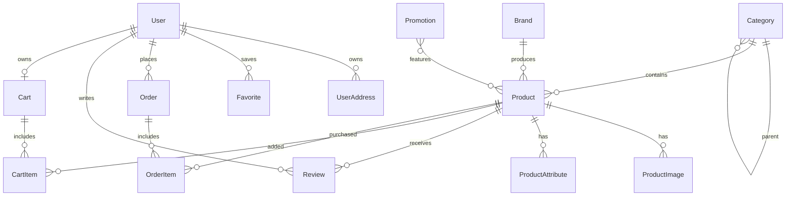

# Furniture Market Monorepo

Production-ready ecommerce foundation inspired by the public UX patterns of nonton.ru: furniture catalog, mega menu, product cards, filters, search, cart, checkout, favorites, profile, orders, brands and promotions.

The implementation is original code and uses independent naming/assets. Do not ship copied proprietary logos, photos or text from a third-party site.

## Architecture Plan

Backend: Django 5, Django REST Framework, SimpleJWT, PostgreSQL, Redis cache, S3-compatible media via django-storages, OpenAPI with drf-spectacular.

Frontend: React 19, Vite, TypeScript, TailwindCSS, shadcn-style primitives, Zustand auth store, TanStack Query, Axios, feature-sliced folders.

Infra: Docker Compose for PostgreSQL, Redis, MinIO, backend, frontend and Nginx reverse proxy. The layout is CI/CD-ready: services are isolated, configuration is environment-driven, and app code is split by domain.

## ER Diagram



## API Structure

Auth:
- `POST /api/auth/register/`
- `POST /api/auth/token/`
- `POST /api/auth/token/refresh/`
- `GET/PATCH /api/auth/profile/`

Catalog:
- `GET /api/categories/`
- `GET /api/brands/`
- `GET /api/products/?q=&category=&brand=&min_price=&max_price=&in_stock=&ordering=`
- `GET /api/products/{slug}/`
- `GET /api/promotions/`

Commerce:
- `GET /api/cart/`
- `POST /api/cart/add/`
- `POST /api/cart/update_item/`
- `POST /api/cart/remove/`
- `POST /api/orders/`
- `GET /api/orders/`

User features:
- `GET/POST /api/favorites/`
- `GET/POST /api/addresses/`
- `GET/POST /api/reviews/?product=`

Docs:
- `GET /api/schema/`
- `GET /api/docs/`

## Frontend Architecture

```text
frontend/src
  app/              app bootstrap, providers, styles, router shell
  pages/            route-level pages
  widgets/          header, footer, page-level blocks
  features/         cart/auth workflows and stores
  entities/         product API and cards
  shared/           axios client, types, UI primitives, utilities
```

## Folder Tree

```text
.
  backend/
    apps/
      users/        custom user, addresses, favorites
      catalog/      categories, brands, products, promos, seed command
      cart/         session/user cart
      orders/       checkout, mock payment, order history
      reviews/      reviews and product rating aggregation
      common/       shared abstract models
    config/         settings, urls, wsgi/asgi
  frontend/
    src/
      app/ pages/ widgets/ features/ entities/ shared/
  infra/nginx/
  docker-compose.yml
  .env.example
```

## Implementation Stages

1. Backend foundation: settings, Docker, PostgreSQL, Redis, S3 configuration, logging, OpenAPI.
2. Auth system: custom user, JWT, roles, profile endpoint, protected routes.
3. Catalog system: categories, subcategories, brands, products, images, attributes, promotions.
4. Product page: gallery, price block, characteristics, reviews-ready API.
5. Cart and checkout: cart CRUD, order creation, mock payment status.
6. User profile: addresses, order history, favorites.
7. Search and filters: PostgreSQL full-text search, price/category/brand/stock facets.
8. UI polishing: responsive header, mega-menu, skeletons, product cards, hover states.
9. Deployment foundation: Nginx, Docker Compose, env-based config, MinIO media.
10. Testing and optimization: add pytest/API tests, Playwright smoke tests, image optimization and CI jobs.

## Local Run

Docker:

```bash
cp .env.example .env
docker compose up --build
```

Without Docker on Windows:

```powershell
winget install --id Python.Python.3.12 --source winget
python -m venv .venv
.\.venv\Scripts\python.exe -m pip install -r backend\requirements.txt
cd backend
$env:USE_SQLITE='True'
..\.venv\Scripts\python.exe manage.py migrate
..\.venv\Scripts\python.exe manage.py bootstrap_catalog --products 420
cd ..\frontend
npm install
cd ..
.\scripts\start-local.ps1
```

Stop local servers:

```powershell
.\scripts\stop-local.ps1
```

Services:
- Frontend: `http://localhost:5173`
- API: `http://localhost:8000/api`
- Swagger: `http://localhost:8000/api/docs/`
- Admin: `http://localhost:8000/admin/`
- MinIO console: `http://localhost:9001`

Demo admin after seed:
- username: `admin`
- password: `admin12345`

## Notes For Production

- Set `DEBUG=False`, a strong `SECRET_KEY`, real `ALLOWED_HOSTS` and strict `CORS_ALLOWED_ORIGINS`.
- Use managed PostgreSQL/Redis/S3 where possible.
- Move Vite build output behind Nginx for production instead of the dev server.
- Add CI steps: backend lint/tests/migrations check, frontend typecheck/build, Docker image scan.
- Add observability hooks: Sentry/OpenTelemetry, request id middleware, structured JSON logs.

## Current Local Feature Coverage

- Home, catalog, search, filters, pagination and product cards.
- Product page with gallery fallback, characteristics, add to cart, favorites and reviews.
- JWT login/register, profile, logout, user addresses and protected checkout messaging.
- Cart quantity updates, removal, checkout and mock paid order creation.
- Favorites list and toggle endpoint.
- Orders page, brands, promotions and 404.
- Toast notifications, skeleton loaders and responsive header/mega menu.
- Backend smoke tests for catalog, cart and favorites.

## Real Catalog Operations

The shop is database-driven. Products can be managed in Django Admin or through authenticated manager/admin API requests.

CSV import for a real supplier/catalog feed:

```powershell
cd backend
$env:USE_SQLITE='True'
..\.venv\Scripts\python.exe manage.py import_catalog ..\catalog.csv
```

There is a ready example at [sample-catalog.csv](sample-catalog.csv):

```powershell
cd backend
$env:USE_SQLITE='True'
..\.venv\Scripts\python.exe manage.py import_catalog ..\sample-catalog.csv
```

Required CSV columns: `sku,title,category,brand,price,stock`.
Optional columns: `slug,description,image_url,old_price,is_hit,is_new,width,depth,height,material,color`.
